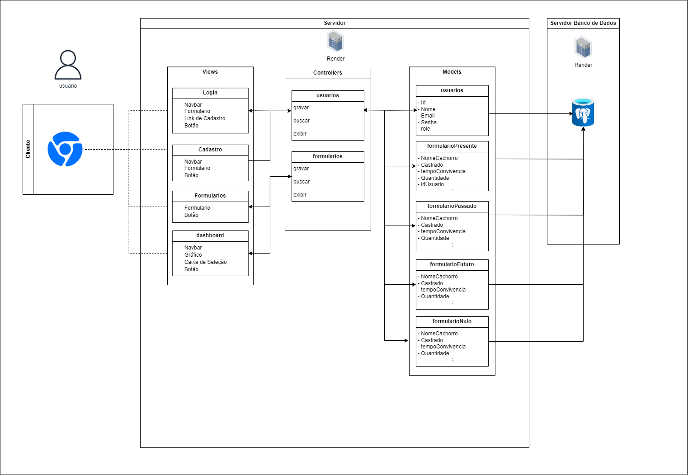
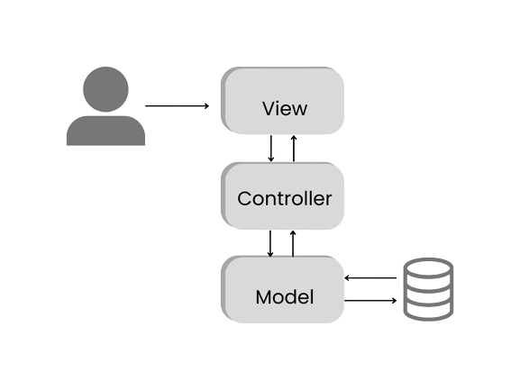
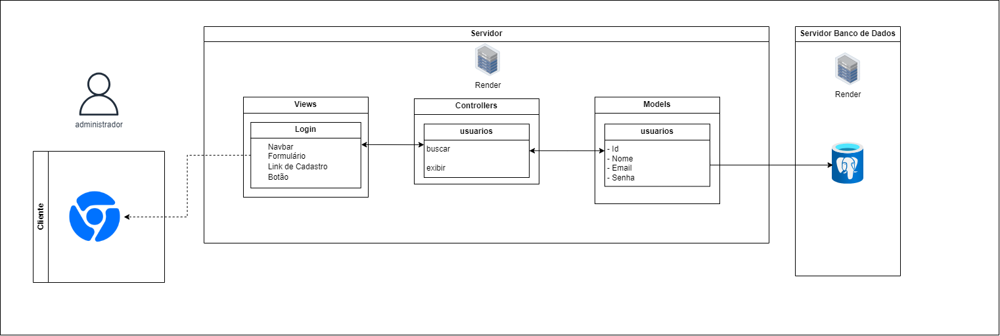
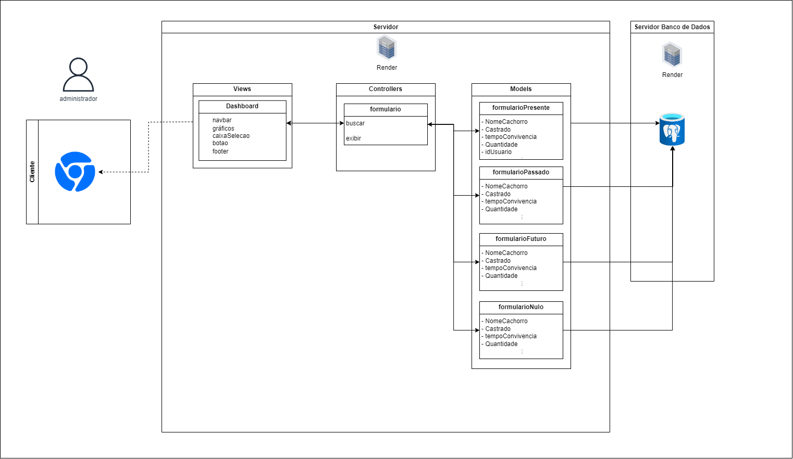
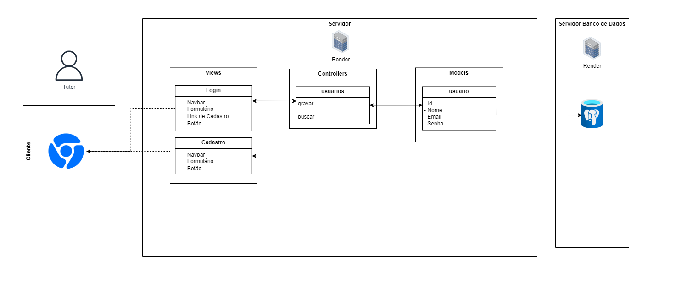
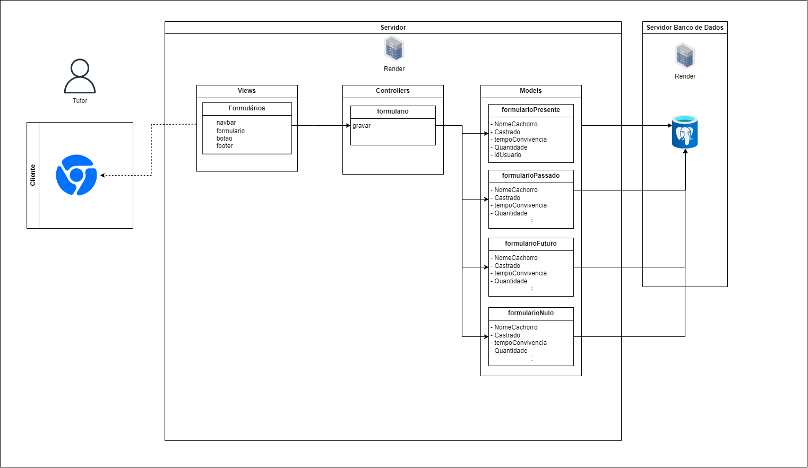

# Ponderada de Programação - Arquitetura MVC

Figura 1 - Arquitetura MVC Geral

Fonte: Material produzido pelo autor (2024).

# 1. Descrição do Projeto
- **Nome do Projeto:** Abandono Zero
- **Descrição:** O escopo macro do projeto consiste em criar uma aplicação WEB mobile e responsiva para Notebook/Desktop para coletar informações de comportamento de tutores sobre critérios de adoção/compra e abandono de cães e gatos, que permita mapear os cenários e coletar os dados diversos dos tutores de forma viva e perene, para que não fiquemos limitados as fotos estáticas do problema.
- **Arquitetura:** MVC (Model-View-Controller)
- **Ferramenta de Diagramação:** A ferramenta de diagramação utilizada consistiu no draw.io

# 2. Introdução
Em 1970, Trygve Reenskaug, enquanto trabalhava com o projeto da linguagem de programação orientada a objetos, desenvolveu a arquitetura MVC, sendo essa a sigla de Model-View-Controller(Modelo-Visão-Controle). Essa arquitetura representa um padrão de design de software conhecido por permitir a separação da lógica e das regras de negócios da apresentação dos dados [1]. 

Por meio desse padrão, é possível dividir uma aplicação em três camadas, levando ao desenvolvimento de aplicações complexas e escaláveis. As camadas da aplicação se dividem em: 

- **Model:** responsável por gerenciar a lógica do negócio e inclui o armazenamento e recuperação de informação a partir do banco de dados, sendo essa a camada que se comunica diretamente com o banco de dados[1].

- **View:** essa é camada responsável pela interface do usuário, sendo os arquivos desenvolvidos em *HTML*, *CSS* e *JavaScript*[1].

- **Controller:** age como um intermediário entre a view e o model, sendo responsável por responder às ações do usuário[1].

Figura 2 - Arquitetura MVC

Fonte: Material produzido pelo autor (2024).

Conforme consta na figura (figura 2), nessa arquitetura o usuário interage com a view e inicia um processo de solicitação, após isso o controller irá pedir ao modelo para fornecer os dados necessário e o modelo irá solicitar os dados do Banco de Dados. Após isso, a base de dados irá enviar a resposta para o model que irá retorná-los para o controller, nessa última etapa o controller irá enviar os dados para a view, que irá exibi-los para o usuário.

Sendo assim, uma Aplicação Web que utiliza o padrão MVC é composta por três camadas: visão, controle e modelo, que atuam em conjunto para garantir o sucesso da aplicação e facilitando a manutenção e a escalabilidade desse projeto.

# 3. Arquitetura do Projeto
Esse projeto tem como objetivo desenvolver uma aplicação web que irá coletar dados de formulários sobre tutores que possuem cachorros, que não possuem e desejam ter ou que não possuem e não querem ter, ou de tutores que já tiveram cachorros, e armazenar essas respostas em um banco de dados, de forma que esses dados possam ser acessados e disponibilizados para downloads, sendo que apenas o administrador tenha acesso a essas informações. 

Sendo assim, visando construir uma aplicação que seja escalável, de fácil manutenibilidade e segura, foi definida uma arquitetura MVC, que se baseia em três camadas: visão, controle e modelo. Conforme apresentado na figura 1, nas views são apresentados quatro elementos, sendo esses: logins, cadastro, formularios, dashboard. Enquanto nos controllers há o usuarios e o formularios, responsável por se comunicar com os cinco models: usuarios, formularioPresente, formularioPassado, formularioFuturo, formularioNulo. 

Entretanto, para facilitar o entendimento da aplicação essa arquitetura foi dividida em duas partes, sendo uma delas para o uso dos tutores (que irão responder os formulários) e outra para uso dos administradores (que irão acessar as respostas no Banco de Dados).

Figura 3 - Acesso do Administrador

Fonte: Material produzido pelo autor (2024).

Essa primeira arquitetura (figura 3) representa o acesso do administrador e possui como elementos:
### Modelos (Models):
No modelo há apenas um elemento, o usuarios, que é responsável por se comunicar com o banco de dados e armazenar os dados dos tutores, sendo esses:
- **id:** identificador de usuário;
- **nome:** nome do usuário;
- **email:** email do usuário;
- **senha:** senha de acesso do usuário;

### Controladores (Controllers):
No controladores há apenas um, chamado de usuarios que é responsável por estabelecer a comunicação entre a view e o model, os métodos apresentados nesse modelo consistem em:

- **buscar:** busca um usuário no banco de dados;
- **exibir:** que irá exibir outra página para o usuário, que será a página de dashboard.

### Views (Views):
Como Views foi estabelecida apenas uma, a view de login que tem como elementos:
- **navbar:** que é a barra de navegação;
- **formulario:** que é o formulário de login;
- **linkdeCadastro:** que é o link que redireciona para a página de cadastro;
- **botao:** que é o botão que irá enviar as informações para o controller. 

### Fluxo de Operações
Seguindo essa arquitetura o fluxo de operações segue a seguinte linha de execução:

1. O administrador acessa a página de login e é apresentado com a view Login.
2. O administrador preenche suas credenciais no formulario e clica no botao para submeter o formulário.
3. A submissão do formulário aciona o método buscar no controlador usuarios.
4. O controlador usuarios usa o modelo usuarios para verificar as credenciais no banco de dados.
5. Se as credenciais estiverem corretas, o controlador invoca o método exibir para carregar o dashboard.
6. A view do dashboard é apresentada ao administrador, possivelmente com informações personalizadas obtidas através do modelo usuarios.

Figura 4 - Dashboard do Administrador

Fonte: Material produzido pelo autor (2024).

A segunda parte dessa arquitetura consiste na exibição das respostas dos usuários tutores para os usuários administradores em uma página dashboard, e segue a seguinte estrutura:

### Modelos (Models):
Como modelo, há quatro estruturas estabelecidas, entretanto, devido as informações disponilizadas até o momento pelo parceiro do projeto, os atributos desses modelos são os mesmos, logo não representam com fidelidade a versão final do projeto.

- **formularioPresente:** contém as informações dos tutores que possuem cachorros
    - **nomeCachorro:** armazena o nome do cachorro do tutor;
    - **castrado:** informa se o cachorro é castrado ou não;
    - **tempoConvivencia:** indica a quanto tempo o tutor está com o cachorro;
    - **quantidade:** informa a quantidade total de animais que o tutor possui.

- **formularioPassado:** contém as informações dos tutores que não possuem mas já tiveram cachorros
    - **nomeCachorro:** armazena o nome do cachorro do tutor;
    - **castrado:** informa se o cachorro é castrado ou não;
    - **tempoConvivencia:** indica a quanto tempo o tutor está com o cachorro;
    - **quantidade:** informa a quantidade total de animais que o tutor possui.

- **formularioFuturo:** contém informações dos tutores que não possuem e que desejam ter cachorros
    - **nomeCachorro:** armazena o nome do cachorro do tutor;
    - **castrado:** informa se o cachorro é castrado ou não;
    - **tempoConvivencia:** indica a quanto tempo o tutor está com o cachorro;
    - **quantidade:** informa a quantidade total de animais que o tutor possui.
    
    Obs: as informações apresentadas são apenas para fins práticos, e não representam as informações finais que serão armazenadas no banco de dados.

- **formularioNulo:** contém informações dos tutores que não possuem e que não desejam ter cachorro
    - **nomeCachorro:** armazena o nome do cachorro do tutor;
    - **castrado:** informa se o cachorro é castrado ou não;
    - **tempoConvivencia:** indica a quanto tempo o tutor está com o cachorro;
    - **quantidade:** informa a quantidade total de animais que o tutor possui.

    Obs: as informações apresentadas são apenas para fins práticos, e não representam as informações finais que serão armazenadas no banco de dados.

### Controllers (Controles):
Como controle dessa aplicação, foi estabelecido apenas um, chamado de formualarios, que possui como métodos:
- **buscar:** busca as informações que o usuário administrador deseja visualizar;
- **exibir:** exibe as informações formatadas em gráficos e tabelas para o usuário.

### Views (Visão):
Nessa arquitetura, também foi estabelecida apenas uma view: o Dashboard, que tem como elementos:
- **navbar:** que é a barra de navegação;
- **graficos:** exibição dos dados contidos no banco de dados;
- **caixaSelecao:** caixas de seleção utilizadas para selecionar quais informações serão exibidas;
- **botao:** botão utilizado para baixar ou exportar as informações;
- **footer:** que é o rodapé da página.

### Fluxo de Operação
Seguindo a arquitetura proposta, o fluxo de operação da aplicação segue a seguinte ordem:

1. O administrador acessa o dashboard e é apresentado com a view *dashboard*.
2. Através da caixaSelecao, o administrador define os filtros de busca, como tipo de formulário, datas, etc.
3. O administrador então aciona o botao para buscar os dados, o que invoca o método buscar no controlador formularios.
4. O controlador formularios consulta os modelos apropriados (presente, passado, futuro, nulo) com os filtros fornecidos para recuperar os dados do banco de dados.
5. Uma vez que os dados são recuperados, o método exibir é utilizado para formatá-los adequadamente em gráficos ou tabelas.
6. Os dados formatados são então enviados de volta para a view Dashboard, onde são apresentados ao administrador nos graficos e tabelas.

Figura 5 - Acesso do Tutor

Fonte: Material produzido pelo autor (2024).

A terceira parte dessa arquitetura (figura 5) consiste na parte do acesso do tutor que visa permitir que ele faça o login na sua conta ou então se cadastre no sistema para responder as perguntas do questionário.

### Modelos (Models):
No modelo há apenas um elemento, o usuarios, que é responsável por se comunicar com o banco de dados e armazenar os dados dos tutores, sendo esses:
- **id:** identificador de usuário;
- **nome:** nome do usuário;
- **email:** email do usuário;
- **senha:** senha de acesso do usuário;

### Controladores (Controllers):
No controladores há apenas um, chamado de usuarios que é responsável por estabelecer a comunicação entre a view e o model, os métodos apresentados nesse modelo consistem em:
- **gravar:** que irá salvar as informações do cadastro do usuário.
- **buscar:** que irá busca um usuário no banco de dados;

### Views (Views):
Como Views foi estabelecida duas, sendo essas:
- **login:** página para login do usuário
    - **navbar:** que é a barra de navegação;
    - **formulario:** que é o formulário de login;
    - **linkdeCadastro:** que é o link que redireciona para a página de cadastro;
    - **botao:** que é o botão que irá enviar as informações para o controller. 

- **cadastro:** página para cadastro do usuário
    - **navbar:** que é a barra de navegação;
    - **formulario:** que é o formulário de login;
    - **botao:** que é o botão que irá enviar as informações para o controller. 

### Fluxo de Operação
Nessa arquitetura o fluxo de operações acontece em duas páginas, sendo assim, são dois fluxos interdependentes entre si, que ocorrem seguindo a seguinte ordem:

**Fluxo Para o Login:**

1. O tutor seleciona a opção de login e preenche suas informações no formulário de login.
2. Ao clicar no botao as informações são enviadas para o controlador usuarios.
3. O controlador utiliza o método buscar para verificar as credenciais no banco de dados através do modelo usuarios.
4. Se as credenciais estiverem corretas, o tutor é autenticado e ganha acesso à sua conta.

**Fluxo Para o Cadastro:**

1. Se o tutor for novo, ele selecionará o linkdeCadastro na página de login, que o redirecionará para a view de cadastro.
2. O tutor preenche o formulario de cadastro com suas informações e clica no botao para submeter.
3. O controlador usuarios recebe os dados e invoca o método gravar para instruir o modelo usuarios a salvar os dados no banco de dados.
4. Uma vez gravados, o tutor é direcionado diretamente para dentro da aplicação.

Figura 6 - Arquitetura Formulários

Fonte: Material produzido pelo autor (2024).

A última parte dessa arquitetura (figura 6) consiste nos formulários de resposta do usuário tutor, ou seja, compreende as páginas em que serão exibidos os formulários.

### Modelos (Models):
Como modelo, há quatro estruturas estabelecidas, entretanto, devido as informações disponilizadas até o momento pelo parceiro do projeto, os atributos desses modelos são os mesmos, logo não representam com fidelidade a versão final do projeto.

- **formularioPresente:** contém as informações dos tutores que possuem cachorros
    - **nomeCachorro:** armazena o nome do cachorro do tutor;
    - **castrado:** informa se o cachorro é castrado ou não;
    - **tempoConvivencia:** indica a quanto tempo o tutor está com o cachorro;
    - **quantidade:** informa a quantidade total de animais que o tutor possui.

- **formularioPassado:** contém as informações dos tutores que não possuem mas já tiveram cachorros
    - **nomeCachorro:** armazena o nome do cachorro do tutor;
    - **castrado:** informa se o cachorro é castrado ou não;
    - **tempoConvivencia:** indica a quanto tempo o tutor está com o cachorro;
    - **quantidade:** informa a quantidade total de animais que o tutor possui.

- **formularioFuturo:** contém informações dos tutores que não possuem e que desejam ter cachorros
    - **nomeCachorro:** armazena o nome do cachorro do tutor;
    - **castrado:** informa se o cachorro é castrado ou não;
    - **tempoConvivencia:** indica a quanto tempo o tutor está com o cachorro;
    - **quantidade:** informa a quantidade total de animais que o tutor possui.
    
    Obs: as informações apresentadas são apenas para fins práticos, e não representam as informações finais que serão armazenadas no banco de dados.

- **formularioNulo:** contém informações dos tutores que não possuem e que não desejam ter cachorro
    - **nomeCachorro:** armazena o nome do cachorro do tutor;
    - **castrado:** informa se o cachorro é castrado ou não;
    - **tempoConvivencia:** indica a quanto tempo o tutor está com o cachorro;
    - **quantidade:** informa a quantidade total de animais que o tutor possui.

    Obs: as informações apresentadas são apenas para fins práticos, e não representam as informações finais que serão armazenadas no banco de dados.

### Controllers (Controles):
Como controle dessa aplicação, foi estabelecido apenas um, chamado de formualarios, que possui como métodos:
- **gravar:** grava as respostas do usuário;

### Views (Visão):
Nessa arquitetura, também foi estabelecida apenas uma view: o Dashboard, que tem como elementos:
- **navbar:** que é a barra de navegação;
- **formulario:** formulário com as perguntas a serem respondidas;
- **botao:** botão utilizado para baixar ou exportar as informações;
- **footer:** que é o rodapé da página.

### Fluxo de Operações
Nessa arquitetura o fluxo de operações ocorre seguindo o fluxo descrito abaixo:
1. O tutor acessa a aplicação e é direcionado para o Dashboard, onde ele pode preencher os formulários de resposta.
2. O tutor seleciona o tipo de formulário que se aplica a ele (Presente, Passado, Futuro ou Nulo) e preenche as informações solicitadas.
3. Após preencher o formulário, o tutor clica no botao de submissão, que inicia o processo de gravação das respostas.
4. O clique no botão dispara uma ação que invoca o método gravar do controlador formularios.
5. O controlador formularios coleta os dados inseridos no formulário e utiliza o modelo correspondente para armazenar as informações no banco de dados.

### Infraestrutura:
Considerando todas as informações apresentadas anteriormente, a aqruitetura MVC será implementada por meio do framework Sails.js, que proporcionará uma estrutura organizada para o desenvolvimento dessa aplicação. Além disso, os componentes a serem utilizados nessa aplicação consistem em:

**Sails.js**

O Sails.js é um framework MVC para Node.js que permite a criação de aplicações web e APIs e implementa o padrão MVC, oferencendo diversas configurações de rotas e suportando diversos bancos de dados, como o PostgreSQL. Dessa forma, esse framework foi escolhido com o intuito de acelerar o desenvolvimento do projeto e pelo fato da sua arquitetura promover a manutenção e a escalabilidade.

**Banco de Dados PostgreSQL**

O PostgreSQL é um sistema de gerenciamento de banco de dados relacional, sendo conhecido por ser robusto e confiável, além disso, ele pode ser integrado com o framework Sails.js o que irá facilitar no desenvolvimento da aplicação.

**Render**

O Render é um serviço de hospedagem de aplicações web que permite a criação de aplicações web e APIs, dessa forma será utilizado para hospedar a aplicação em Sails.js e o banco de PostgreSQL, de forma que esses possam ser escalados de acordo com a demanda, e que o processo de monitoramento da aplicaçãos seja facilitado.

**API dos Correios**

A API dos Correios é uma API que permite a consulta de CEPs e endereços, sendo utilizada para garantir a padronização das respostas nos formulários, de forma que os dados não sejam corrompidos. 

Com base nessas tecnologias, no Sails.js, os models representam a estrutura de dados da aplicação e são usados para interagir com o PostgreSQL, definindo as regras de negócios e validações que são aplicadas antes que os dados sejam enviados ao banco de dados e garantindo a integridade e a qualidade dos dados persistidos. Enquanto, as views no Sails.js são geradas no lado do servidor e enviadas para o cliente, sendo responsáveis por apresentar a interface do usuário de forma dinâmica e interativa, utilizando os dados fornecidos pelos controladores. Por fim, os controladores no Sails.js lidam com a lógica de processamento de entrada de dados, manipulação de modelos e seleção de views. Eles atuam como o intermediário entre os models e as views, garantindo que as ações do usuário sejam tratadas corretamente e que as respostas adequadas sejam fornecidas.

### Justifique as escolhas feitas e como elas impactam o projeto.

A escolha do Sails.js como framework de desenvolvimento permite que a aplicação seja desenvolvida de forma mais rápida e organizada e que os dados sejam persistidos de forma segura e confiável. Além disso, A combinação do Sails.js com o PostgreSQL e o Render fornece uma base sólida para uma aplicação escalável e segura. Por fim, a API dos Correios complementa essa infraestrutura ao melhorar a qualidade dos dados e a experiência do usuário final.

#### Implicações da Arquitetura:
Com base em todas as escolhas definidas anteriormente, é esperado que o projeto apresente as seguintes implicações:
- **Escalabilidade:** A arquitetura MVC, em conjunto com o Sails.js e o Render, proporciona uma capacidade de escalar, garantindo que a aplicação possa lidar com um número crescente de usuários e dados sem uma perda de performance.

- **Manutenção:** O uso do framework baseado em MVC facilita a manutenção e atualizações da aplicação, sendo que as alterações em uma parte do sistema (Model, View ou Controller) podem ser feitas com um mínimo de impacto nas outras partes, reduzindo as falhas na aplicação.

- **Testabilidade:** Como o Sails.js suporta testes de unidade e integração, os testes automatizados são simplificados e podem ser executados com maior frequência.

- **Segurança:** A estrutura MVC do Sails.js ajudam a proteger a aplicação contra vulnerabilidades comuns ao encapsular as operações de banco de dados e ao separar a lógica de aplicação da apresentação do usuário. Além disso, o PostgreSQL oferece recursos de segurança que são fundamentais para a proteção de dados sensíveis.

- **Qualidade dos Dados:** A utilização da API dos Correios para validação dos dados de endereço aumenta a qualidade dos dados coletados e evita divergências nesses dados.

# Referências
[1] ALVES, William Pereira. Java para Web: desenvolvimento de aplicações. São Paulo: Erica, 2015. 1 recurso online. ISBN 9788536519357. Disponível em: https://integrada.minhabiblioteca.com.br/books/9788536519357. Acesso em: 27 abr. 2024.

### Recursos Adicionais:
Documentação do Sails.js: https://github.com/balderdashy/sails
Tutorial do draw.io: https://m.youtube.com/watch?v=w3zm-wbmlpc
Exemplos de diagramas MVC: https://www.lucidchart.com/pages/templates

